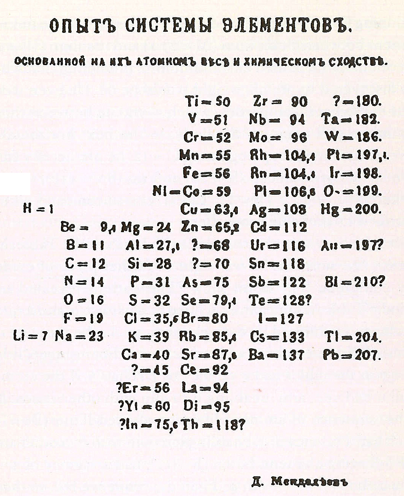

# The First Table
Dimitri Mendeleev devised the first modern table, however he organized the elements as going up in atomic weight going down in a list, rather than across as we know it today. However, he did leave gaps for elements that were yet undiscovered. He also predicted some properties of these undiscovered elements. However, some discrepancies, such as iodine and tellurium, could not be explained. Sub-atomic particles did not exist as a concept in Mendeleev's time, so all of the elements were ordered based on atomic mass, not number. 

# Predictions
Later, elements predicted by Mendeleev were discovered, such as gallium (1875), scandium (1879), and germanium (1886). This verified his periodic table and it gained universal recognition. In 1955, the 101st element, mendelevium, was named in his honor.

